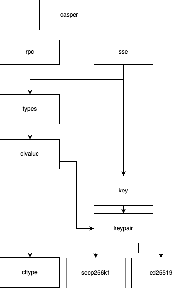

# Casper Go SDK
[](https://badge.fury.io/gh/make-software%2Fcasper-go-sdk)
[](https://github.com/make-software/casper-go-sdk/actions/workflows/quality-check.yml)

The Casper Go SDK provides a convenient way to interact with the Casper Network using Go.

## Get started

```shell
go get github.com/make-software/casper-go-sdk
```

## Base usage

### RPC client

Package rpc provides access to the exported methods of RPC Client and data structures where the response is serialized.
[See more details here](rpc/README.md)

Example:
```go
package main

import (
	"context"
	"fmt"
	"net/http"

	"github.com/make-software/casper-go-sdk/casper"
)

func main() {
	handler := casper.NewRPCHandler("https://casper-node-proxy.dev.make.services/rpc", http.DefaultClient)
	client := casper.NewRPCClient(handler)
	deployHash := "62972eddc6fdc03b7ec53e52f7da7e24f01add9a74d68e3e21d924051c43f126"
	deploy, err := client.GetDeploy(context.Background(), deployHash)
	if err != nil {
		return
	}
	fmt.Println(deploy.Deploy.Hash)
}
```

### SSE

The SSE package provides basic functionality to work with Casper events that streamed by SSE server.
[See more details here](sse/README.md)

Example:
```go
package main

import (
	"context"
	"log"

	"github.com/make-software/casper-go-sdk/sse"
)

func main() {
	client := sse.NewClient("https://casper-node-proxy.dev.make.services/events/main")
	defer client.Stop()
	client.RegisterHandler(
		sse.DeployProcessedEventType,
		func(ctx context.Context, rawEvent sse.RawEvent) error {
			deploy, err := rawEvent.ParseAsDeployProcessedEvent()
			if err != nil {
				return err
			}
			log.Printf("Deploy hash: %s", deploy.DeployProcessed.DeployHash)
			return nil
		})
	lastEventID := 1234
	client.Start(context.TODO(), lastEventID)
}
```

### Work with Casper types

SDK implements base functionality that allows to work with native Casper types.

* High-level types declaration and the base functions to construct them. [details](types/README.md)
* Low level types (CLValue) with base functionality [details](types/clvalue/README.md)
* Identifiers, hashes and related functions [details](types/key/README.md)
* Cryptography public and private keys functionality [details](types/keypair/README.md)

Example of how to construct a deploy and push it to the network:
```go
package main

import (
	"context"
	"encoding/hex"
	"log"
	"math/big"
	"net/http"

	"github.com/make-software/casper-go-sdk/casper"
	"github.com/make-software/casper-go-sdk/types/clvalue"
)

func main() {
	accountPublicKey, err := casper.NewPublicKey("012488699f9a31e36ecf002675cd7186b48e6a735d10ec1b308587ca719937752c")
	if err != nil { return }
	amount := big.NewInt(100000000)
	session := casper.ExecutableDeployItem{
		ModuleBytes: &casper.ModuleBytes{
			ModuleBytes: hex.EncodeToString([]byte("<<<Contract Wasm>>>")),
			Args: (&casper.Args{}).
				AddArgument("target", clvalue.NewCLByteArray(accountPublicKey.AccountHash().Bytes())).
				AddArgument("amount", *clvalue.NewCLUInt512(amount)),
		},
	}

	payment := casper.StandardPayment(amount)

	deployHeader := casper.DefaultHeader()
	deployHeader.Account = accountPublicKey
	deployHeader.ChainName = "test-net"

	newDeploy, err := casper.MakeDeploy(deployHeader, payment, session)

	handler := casper.NewRPCHandler("https://casper-node-proxy.dev.make.services/rpc", http.DefaultClient)
	client := casper.NewRPCClient(handler)
	result, err := client.PutDeploy(context.Background(), *newDeploy)
	
	log.Println(result.DeployHash)
}
```

## Advanced usage

It is crucial to have a clear understanding of the SDK structure and its functionalities in order to avoid common mistakes or misuse of functionality. The SDK consists of several packages that have strict dependencies.

If we were to present the packages in different layers, the structure would be as follows (in ascending order, from low to high):

1. Lowest layer: `cltype` and `keypair`
2. `key`
3. `clvalue`
4. `types`
5. Services `rpc` and `sse`
6. The highest level is a facade that provides popular interfaces through the `casper` package

The Dependency tree can help to visualise:



Links to package documentation and examples:
1. `cltype` [examples](tests/types/cl_value/cl_type/list_test.go)
2. `clvalue` [doc](types/clvalue/README.md) | [examples](tests/types/cl_value/example_test.go)
3. `keypair` [doc](types/keypair/README.md) | [examples](tests/types/keypair/private_key_test.go)
4. `types` [doc](types/README.md) | [examples](tests/types/deploy_make_test.go)
5. `rpc` [doc](rpc/README.md) | [examples](tests/rpc/client_example_test.go)
6. `sse` [doc](sse/README.md) | [examples](tests/sse/example_test.go)


### Lint and test

To install necessary Go tools, use the following commands:
```shell
go install -v github.com/incu6us/goimports-reviser/v3@latest
go install github.com/golangci/golangci-lint/cmd/golangci-lint@v1.50.1
```

Run linters:
```shell
go fmt ./...
go vet ./...
goimports-reviser ./...
golangci-lint run
```

Run tests:
```shell
go test ./...
```

## Get Involved

We hope you find this SDK to be a useful tool for interacting with the Casper Network using Go. We've strived to make it as intuitive and user-friendly as possible, but we understand that there's always room for improvement.

Should you have any questions, issues, or suggestions, please don't hesitate to open an issue in our [GitHub repository](https://github.com/make-software/casper-go-sdk/issues). If you are interested in contributing to the Casper Go SDK, we would be thrilled to welcome you to our community. Please check out the [CONTRIBUTING.md](CONTRIBUTING.md) guide for more information.

Remember, the power of blockchain networks is in their communities. Every question you ask, issue you open, or contribution you make, helps to improve the Casper Go SDK and benefits the entire Casper ecosystem.

Thank you for your interest in our project, and we look forward to building the future of the Casper Network together!
