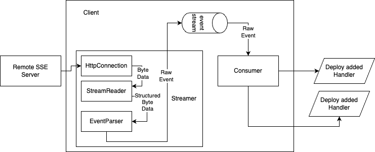

### Architecture:

#### Key components
* `Client` is a facade that provide convenient interface to process data stream, and unites `Streamer` and `Consumer` under implementation.
* `Streamer` fills the events' channel
    * `HttpConnection` establish, controls and watches connections, throw error (notify stream) if connection broken
    * `StreamReader` read bytes lines from the response stream, detect data messages and corespondent ID
    * `EventParser` parse event type from byte data, return event type and raw data
*
* `Consumer` read events stream and delegate to process each to the specific handler
* `Handler` accepts `RawEvent` for certain type, parse body, provide business logic

#### Features:
* Work with context
* Can run async consumers (`Test_Example_With5Workers` [examples](../tests/sse/example_test.go))
* Fully configurable (http options) (check `Test_SSE_WithConfigurations` in [examples](../tests/sse/example_test.go))
* `Streamer` and `Consumer` can work independently
* Error handling flexible, the **caller** should control a behavior ([examples](../tests/sse/example_test.go))
* Supports middleware (`Test_Example_WithMiddleware` in [examples](../tests/sse/example_test.go))
* `Flow control` will notify caller if worker works too slow in compare to streamer. (`Test_Example_CloseSlowConsuming` in [examples](../tests/sse/example_test.go))

#### Warning:
* Doesn't support failure tolerance out of the box. The **caller** should control consistency of the data and provide reconnection strategy on top of the client.
* Doesn't support distributed transactions. This is a **caller** responsibility to control behavior of partial processed events.
* Consumers can work async, but in this case this is a **caller** responsibility to control order of processed events, handle errors and observe the consistency.

For details of the advanced usage please check [examples](../tests/sse/example_test.go)